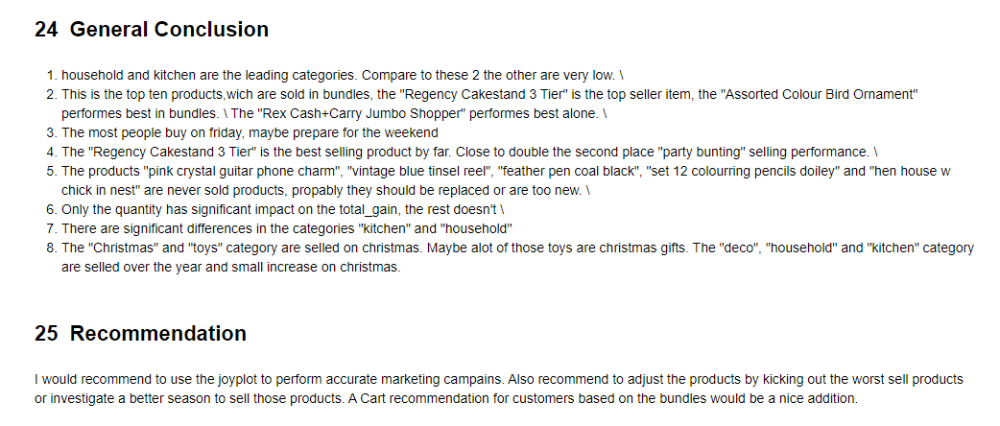
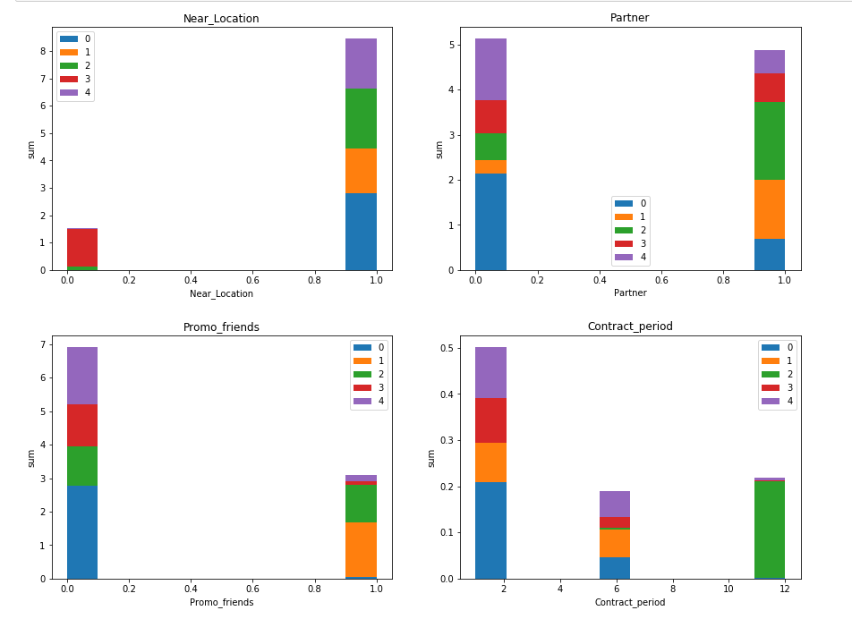

# Data Analysis Repository

## This is my personal repository for show my data-related skills and experience.

# Project: Data-preprocessing

Your project is to prepare a report for a bank’s loan division. You’ll need to find out if a customer’s marital status and number of children have an impact on whether they will default on a loan. The bank already has some data on customers’ credit worthiness.
Your report will be considered when building a credit score for a potential customer. A credit score is used to evaluate the ability of a potential borrower to repay their loan.

Used libaries:
- Numpy
- Pandas

 
 
 

[Link to full project](https://github.com/Tommy-Python/Data-Analysis-Portfolio/blob/main/data_preprocessing/data-preprocessing.ipynb)

# Project: AB-Test

You've received an analytical task from an international online store. Your predecessor failed to complete it: they launched an A/B test and then quit (to start a watermelon farm in Brazil). They left only the technical specifications and the test results.

Used libaries:
- Numpy
- Pandas
- Plotly Express
- Scipy
- Matplotlib
- Functools
- Math
- Warnings
- Seaborn
- Datetime 

 
 

[Link to full project](https://github.com/Tommy-Python/Data-Analysis-Portfolio/blob/main/ab_test/AB-Test.ipynb)

# Project: Business Analytics

You've done beautifully in the Practicum course, and you've been offered an internship in the analytical department at Yandex.Afisha. Your first task is to help optimize marketing expenses.

## Goal:
- Product:
How many people use it every day, week, and month?
How many sessions are there per day? (One user might have more than one session.)
What is the length of each session?
How often do users come back?
- Sales:
When do people start buying? (In KPI analysis, we're usually interested in knowing the time that elapses between registration and conversion — when the user becomes a customer. For example, if registration and the first purchase occur on the same day, the user might fall into category Conversion 0d. If the first purchase happens the next day, it will be Conversion 1d. You can use any approach that lets you compare the conversions of different cohorts, so that you can determine which cohort, or marketing channel, is most effective.)
How many orders do they make during a given period of time?
What is the average purchase size?
How much money do they bring? (LTV)
- Marketing:
How much money was spent? Overall/per source/over time
How much did customer acquisition from each of the sources cost?
How worthwhile where the investments? (ROI)
  
Used libaries:
- Numpy
- Pandas
- Scipy
- Matplotlib
- Functools
- Warnings
- Seaborn

 
 
 
 
 
 
 
 
 
 

 
 

[Link to full project](https://github.com/Tommy-Python/Data-Analysis-Portfolio/blob/main/ba/BA.ipynb)

# Project: Ecommerce

## Goal

What do you want to achieve and why?
- Analyze the product range, determine relationships and trends for a good item overview and recommendations

Who's interested in what you produce?
- The productmanager and me

What decisions will be made based on your analysis?
- Expand or shrink the group of products and help the marketingteam with their campaign

Used libaries:
- Numpy
- Pandas
- Scipy
- Matplotlib
- Functools
- Warnings
- Seaborn
- Counter
- datetime
- reduce

 
 
 
 
 
 
 
 
 
 

[Link to full project](https://github.com/Tommy-Python/Data-Analysis-Portfolio/blob/main/ecommerce/ecommerce.ipynb)

# Project: EDA
You're an analyst at Crankshaft List. Hundreds of free advertisements for vehicles are published on your site every day. You need to study data collected over the last few years and determine which factors influence the price of a vehicle.

Used libaries:
- Numpy
- Pandas
- Scipy
- Matplotlib
- Functools
- Warnings
- Seaborn
- Counter
- datetime
- reduce

 
 

 
 
 
 

[Link to full project](https://github.com/Tommy-Python/Data-Analysis-Portfolio/blob/main/eda/EDA.ipynb)

# Project: Machine Learning
The gym chain Model Fitness is developing a customer interaction strategy based on analytical data.
One of the most common problems gyms and other services face is customer churn. How do you know if a customer is no longer with you? You can calculate churn based on people who get rid of their accounts or don't renew their contracts. However, sometimes it's not obvious that a client has left: they may walk out on tiptoes.
Churn indicators vary from field to field. If a user buys from an online store rarely but regularly, you can't say they're a runaway. But if for two weeks they haven't opened a channel that's updated daily, that's a reason to worry: your follower might have gotten bored and left you.
For a gym, it makes sense to say a customer has left if they don't come for a month. Of course, it's possible they're in Cancun and will resume their visits when they return, but's that's not a typical case. Usually, if a customer joins, comes a few times, then disappears, they're unlikely to come back.
In order to fight churn, Model Fitness has digitized a number of its customer profiles. Your task is to analyze them and come up with a customer retention strategy.

## Goal:
Learn to predict the probability of churn (for the upcoming month) for each customer
Draw up typical user portraits: select the most outstanding groups and describe their main features
Analyze the factors that impact churn most
Draw basic conclusions and develop recommendations on how to improve customer service:
Identify target groups
Suggest measures to cut churn
Describe any other patterns you see with respect to interaction with customers

Used libaries:
- Numpy
- Pandas
- Scipy
- Matplotlib
- Functools
- Warnings
- Seaborn
- Counter
- datetime
- reduce
- sklearn

 
 
 
 
 
 
 
 

[Link to full project](https://github.com/Tommy-Python/Data-Analysis-Portfolio/blob/main/ml_churnrate/ML-Churnrate.ipynb)

# Project: SDA
You work as an analyst for the telecom operator Megaline. The company offers its clients two prepaid plans, Surf and Ultimate. The commercial department wants to know which of the plans brings in more revenue in order to adjust the advertising budget.
You are going to carry out a preliminary analysis of the plans based on a relatively small client selection. You'll have the data on 500 Megaline clients: who the clients are, where they're from, which plan they use, and the number of calls they made and text messages they sent in 2018. Your job is to analyze clients' behavior and determine which prepaid plan brings in more revenue.

Used libaries:
- Numpy
- Pandas
- Scipy
- Functools
- Warnings
- reduce
- matplotlib

 

 
 
 
 
 
 

[Link to full project](https://github.com/Tommy-Python/Data-Analysis-Portfolio/blob/main/sda/SDA.ipynb)

# Project: SQL

The coronavirus took the entire world by surprise, changing everyone's daily routine. City dwellers no longer spent their free time outside, going to cafes and malls; more people were home, reading books. That attracted the attention of startups that rushed to develop new apps for book lovers. You've been given a database of one of the services competing in this market. It contains data on books, publishers, authors, and customer ratings and reviews of books. This information will be used to generate a value proposition for a new product.

Used libaries:
- SQAlchemy
- Pandas

 
 
 
 
 

[Link to full project](https://github.com/Tommy-Python/Data-Analysis-Portfolio/blob/main/sql/SQL.ipynb)

