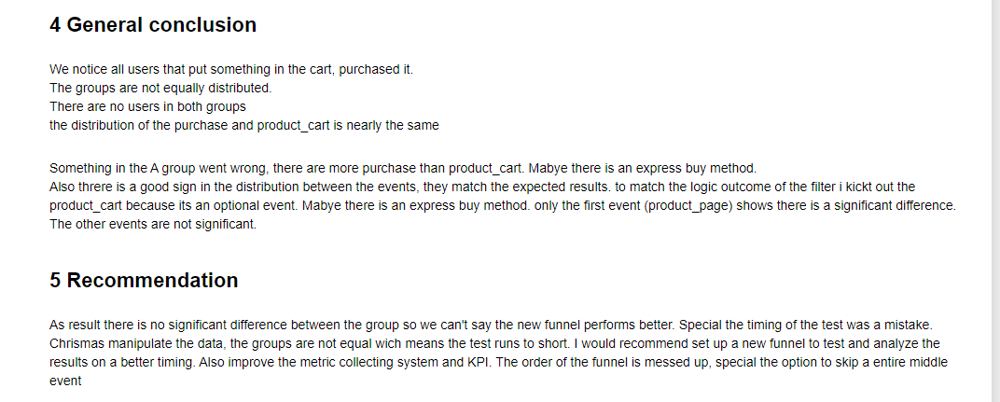

You've received an analytical task from an international online store. Your predecessor failed to complete it: they launched an A/B test and then quit (to start a watermelon farm in Brazil). They left only the technical specifications and the test results.

Used libaries:
- Numpy
- Pandas
- Plotly Express
- Scipy
- Matplotlib
- Functools
- Math
- Warnings
- Seaborn
- Datetime 

[Link to the notebook](https://github.com/Tommy-Python/Data-Analysis-Portfolio/blob/main/ab_test/AB-Test.ipynb)

 
 

[Link to the notebook](https://github.com/Tommy-Python/Data-Analysis-Portfolio/blob/main/ab_test/AB-Test.ipynb)
