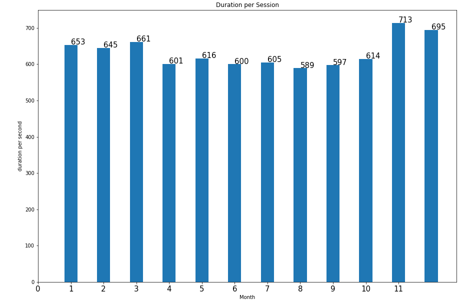
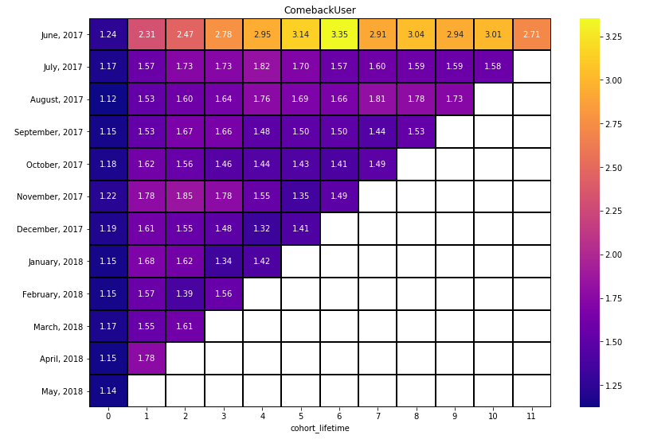
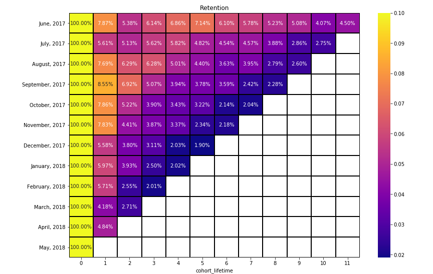
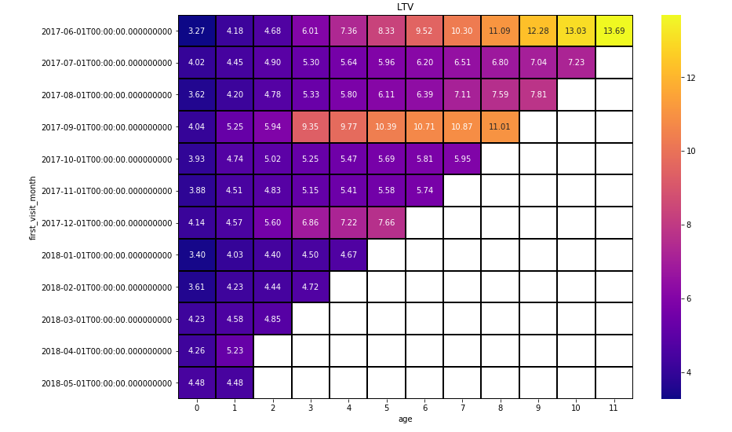
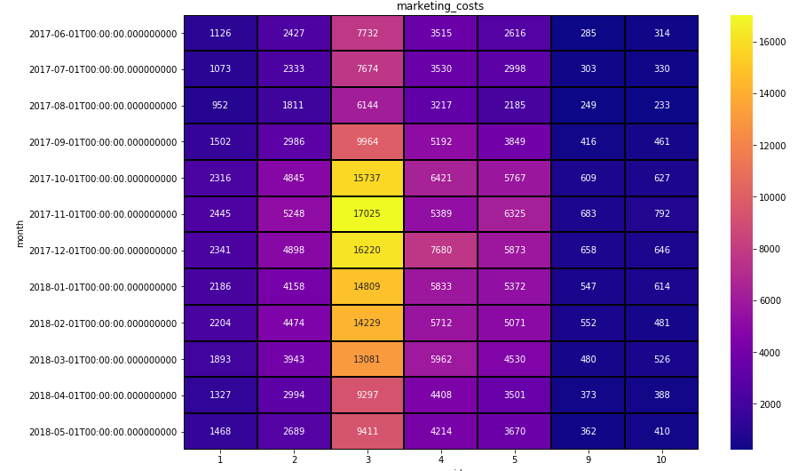
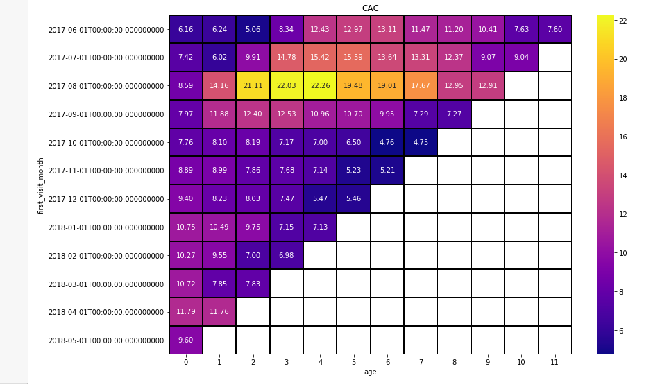
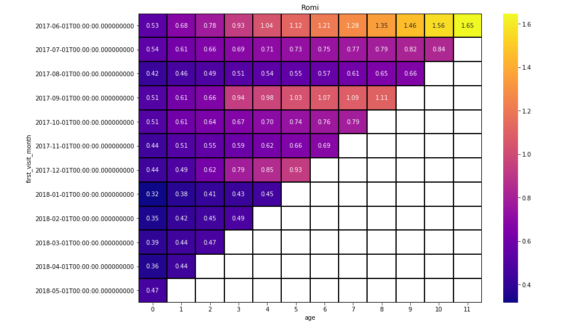

# Project: Business Analytics

You've done beautifully in the Practicum course, and you've been offered an internship in the analytical department at Yandex.Afisha. Your first task is to help optimize marketing expenses.

## Goal:
- Product:
How many people use it every day, week, and month?
How many sessions are there per day? (One user might have more than one session.)
What is the length of each session?
How often do users come back?
- Sales:
When do people start buying? (In KPI analysis, we're usually interested in knowing the time that elapses between registration and conversion — when the user becomes a customer. For example, if registration and the first purchase occur on the same day, the user might fall into category Conversion 0d. If the first purchase happens the next day, it will be Conversion 1d. You can use any approach that lets you compare the conversions of different cohorts, so that you can determine which cohort, or marketing channel, is most effective.)
How many orders do they make during a given period of time?
What is the average purchase size?
How much money do they bring? (LTV)
- Marketing:
How much money was spent? Overall/per source/over time
How much did customer acquisition from each of the sources cost?
How worthwhile where the investments? (ROI)
  
Used libaries:
- Numpy
- Pandas
- Scipy
- Matplotlib
- Functools
- Warnings
- Seaborn

 
 
 
 
 
 
 
 
 
 

 
 

[Link to the notebook](https://github.com/Tommy-Python/Data-Analysis-Portfolio/blob/main/ba/BA.ipynb)
